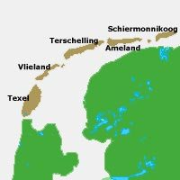

# CS50P Final project: Wad's Up
##


#### Wad's Up helps tourists and day-trippers to determine which Dutch Wadden Island best matches their preferences.
#### Video Demo

## Description
The Dutch Wadden Islands are beautiful and very popular. It is difficult for tourists and day trippers to choose which island they want to visit. Wad's Up assists them with this.
Wad's Up will ask the user about their preferences regarding 3 characteristics of the islands (car-free, cycling network and ferry price). The preferences will be scored with a 5-point Likert scale. In this way the most suitable island for the user can be determined.
If multiple islands have the same score, the winning island will be determined randomly. This is to prevent choice overload (for the user).
Once the winning island has been determined, some statistics are shown and the winning island is returned to the user. Cowsay is used here so that some ASCII art is created. And a video starts about the winning island.

## Project Files
Below a list of the different files that are part of the project. For the first two files a list of the functions is given. A short description is given of each function.
###  __project.py__
   * __main():__ _starting point of execution of Wad's Up_
   * __def check(answer, name):__ _checks if user is interested
    in visiting a Dutch Wadden islands_
   * __def user_input():__ _collects user input regarding their preferences_
   * __def preferences(no_cars, ferry, cycle_network):__ _calculates the score on a Likert scale and updates dictionary where the scores are kept_
   * __def determine_winner(islands):__ _determines winner. If multiple winners, randomly  chooses a winner_
   * __def stats(islands):__ _converts dictionary in pandas DataFrame and calculates mean and median_
   * __def your_destiny(name, island):__ _returns winner to user_
   * __def countdown(t):__ _counts down to zero after which the YouTube video about winning island is started'_
   * __def youtube(island_url):__ _starts video of winning island_

### __test_project.py__
   * __def test_check_yes():__ _tests user input 'yes' and 'YEs'_
   * __def test_check_no():__ _tests user input 'n'_
   * __def test_user_input():__ _tests storing user input in a list_
   * __def test_preferences():__ _tests if user input calculates the right score_
   * __def test_your_destiny():__ _prints winning island using cowsay_
   * __def test_your_destiny_wrong_island():__ _tests input 'wrong' island_
   * __def test_determine_winner_one_winner():__ _tests one winner_
   * __def test_determine_winner_multiple_winner():__ _tests if winner is in list of islands with the same score_
   * __def test_stats():__ _Testing if pandas dataframe is created, mean and median_
   * __def test_countdown():__ _Function tests if "None" is returned_

### __requirements.txt__
```
Package         Version
-------         -------
colorama        0.4.4
cowsay          6.1
mypy            1.7.0
pandas          2.1.3
pytest          7.4.3
pytube          15.0.0
```
## Project style
PEP 8 and PEP 257 (Docstring Conventions) provide code conventions. This can be deviated from if there is good reason for doing so. The most important thing is monitoring consistency within a project and a module. The aim at Wad's Up has been to write readable and consistent code that follows the conventions laid down in PEP 8 and PEP 257. To check this, the following programs were used::
- Black: [https://black.readthedocs.io/en/stable/]
- Pylint[https://pypi.org/project/pylint/]
- style50

## Design decisions
Likert questions were chosen to measure the user's preferences. For the Likert questions, users have 5 answer options. This allows the score to be measured more accurately than with yes/no questions.

Pylint E1101: Module 'cowsay' has no 'tux' member (no-member) was disabled in "def your_destiny(name, island)" because it gives a false positive: [https://github.com/pylint-dev/pylint/issues/3684]

## User instructions
- Open Visual Studio Code or another IDE
- Place the files "project.py", "test_project.py" and "requirement.txt" in the same top-level root directory (folder)
- install the folowing packages: cowsay, mypy 1.7.0, pandas, pytube and types-colorama
- excecute project.py with "python project.py"
- give user input when asked
- when finished book the ferry to your favorite island🙂


